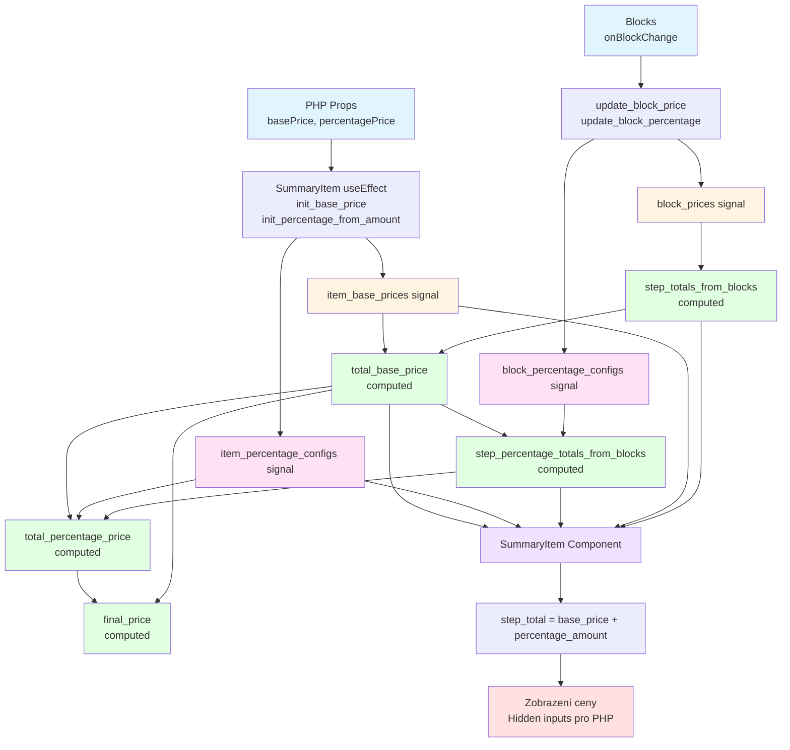
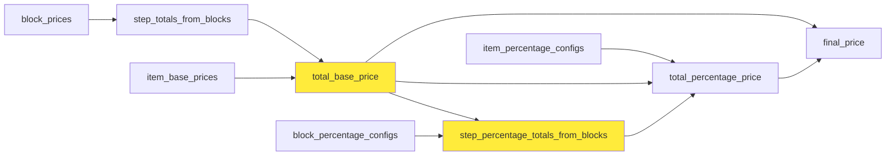
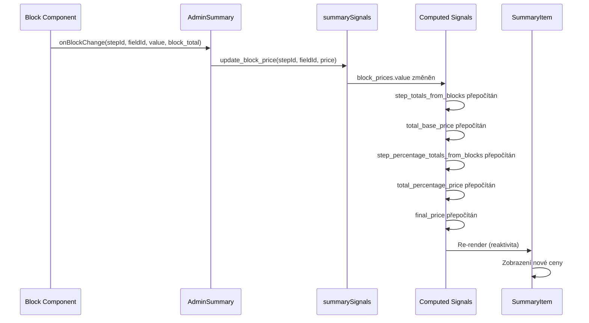

# Signal Price Flow - Item Price Calculation

## Přehled

Tento dokument popisuje, jak signály pracují s item price flow v systému WPCBooking Summary. Systém používá Preact Signals pro reaktivní správu cen na úrovni steps a blocks.

## Architektura signálů

### 1. Vstupní signály (Raw Data)

```
┌─────────────────────────────────────────────────────────────┐
│                    VSTUPNÍ SIGNÁLY                           │
├─────────────────────────────────────────────────────────────┤
│                                                              │
│  block_prices                                                │
│  { stepId: { fieldId: price } }                             │
│  Příklad: { 1: { "field_123": 100, "field_456": 50 } }      │
│                                                              │
│  item_base_prices (LEGACY)                                   │
│  { stepId: basePrice }                                       │
│  Příklad: { 1: 500, 2: 300 }                                │
│                                                              │
│  block_percentage_configs                                    │
│  { stepId: { fieldId: { value, operation } } }              │
│  Příklad: { 1: { "field_123": { value: 10, op: 'add' } } } │
│                                                              │
│  item_percentage_configs (LEGACY)                            │
│  { stepId: { value, operation } }                            │
│  Příklad: { 3: { value: 10, operation: 'add' } }            │
│                                                              │
└─────────────────────────────────────────────────────────────┘
```

### 2. Computed signály (Agregace)

```
┌─────────────────────────────────────────────────────────────┐
│                  COMPUTED SIGNÁLY                            │
├─────────────────────────────────────────────────────────────┤
│                                                              │
│  step_totals_from_blocks                                     │
│  └─ Agreguje block_prices na step level                     │
│     { stepId: sum(block_prices[stepId]) }                   │
│                                                              │
│  total_base_price                                            │
│  └─ Suma všech step totals                                   │
│     └─ Priorita: block_price > legacy_price                 │
│                                                              │
│  step_percentage_totals_from_blocks                         │
│  └─ Agreguje block_percentage_configs na step level        │
│     └─ Závisí na total_base_price                           │
│                                                              │
│  total_percentage_price                                      │
│  └─ Suma block + legacy percentages                         │
│                                                              │
│  final_price                                                 │
│  └─ total_base_price + total_percentage_price               │
│                                                              │
└─────────────────────────────────────────────────────────────┘
```

## Flow diagram



## Detailní flow v SummaryItem

### 1. Inicializace (useEffect)

```javascript
useEffect(() => {
  init_base_price(step, basePrice);           // → item_base_prices[step] = basePrice
  if (percentagePrice !== 0) {
    init_percentage_from_amount(step, percentagePrice);  // → item_percentage_configs[step]
  }
}, [step, basePrice, percentagePrice]);
```

### 2. Čtení Base Price

```javascript
// Priorita: 1) block_prices agregované, 2) legacy item_base_prices, 3) PHP prop
const block_total = step_totals_from_blocks.value[step];  // Agregace z block_prices
const legacy_total = item_base_prices.value[step];         // Legacy signal
const base_price = block_total ?? legacy_total ?? basePrice ?? 0;
```

**Flow:**
```
block_prices[step] 
  → step_totals_from_blocks (computed agregace)
    → block_total
      → base_price (priorita: block_total > legacy_total > basePrice prop)
```

### 3. Čtení Percentage Amount

```javascript
// Block-level percentage (nový systém)
const block_percentage = step_percentage_totals_from_blocks.value[step] || 0;

// Legacy percentage (pro zpětnou kompatibilitu)
const legacy_config = item_percentage_configs.value[step];
let legacy_percentage = 0;
if (legacy_config) {
  if (legacy_config.amount !== undefined) {
    legacy_percentage = config.operation === 'subtract' ? -config.amount : config.amount;
  } else if (legacy_config.value && legacy_config.value !== 0) {
    const base_for_calc = total_base_price.value;  // Závisí na total_base_price!
    const calc_amount = base_for_calc * (Math.abs(config.value) / 100);
    legacy_percentage = config.operation === 'subtract' ? -calc_amount : calc_amount;
  }
}

const percentage_amount = block_percentage + legacy_percentage;
```

**Flow:**
```
block_percentage_configs[step]
  → step_percentage_totals_from_blocks (computed, závisí na total_base_price)
    → block_percentage
    
item_percentage_configs[step]
  → legacy_percentage (výpočet z total_base_price pokud je value)
    → percentage_amount = block_percentage + legacy_percentage
```

### 4. Finální výpočet Step Total

```javascript
const step_total = base_price + percentage_amount;
```

## Závislosti computed signálů



**Kritické závislosti:**
- `step_percentage_totals_from_blocks` **MUSÍ** být definován až po `total_base_price`
- `total_percentage_price` závisí na `total_base_price` (pro legacy percentage výpočty)
- `final_price` je finální agregace všech cen

## Aktualizace cen z bloků

### Flow při změně bloku



### Příklad: Aktualizace base price z bloku

```javascript
// V AdminSummary.jsx
const handleBlockChange = (stepId, fieldId, value, block_total = null) => {
  if (block_total !== null && block_total !== undefined) {
    update_base_price(stepId, block_total);  // Legacy způsob
    // NEBO
    update_block_price(stepId, fieldId, block_total);  // Nový způsob
  }
};
```

**Rozdíl:**
- `update_base_price` → `item_base_prices[stepId]` (legacy, step-level)
- `update_block_price` → `block_prices[stepId][fieldId]` (nový, block-level)

## Priorita cen v SummaryItem

```
base_price = 
  block_totals_from_blocks[step] ??      // 1. Priorita: Agregované block prices
  item_base_prices[step] ??              // 2. Legacy signal
  basePrice (PHP prop) ??                 // 3. Fallback na prop
  0                                       // 4. Default
```

## Struktura dat

### block_prices
```javascript
{
  1: {
    "field_123": 100,    // Block cena pro field_123 v step 1
    "field_456": 50      // Block cena pro field_456 v step 1
  },
  2: {
    "field_789": 300     // Block cena pro field_789 v step 2
  }
}
```

### step_totals_from_blocks (computed)
```javascript
{
  1: 150,  // Suma: 100 + 50
  2: 300   // Suma: 300
}
```

### block_percentage_configs
```javascript
{
  1: {
    "field_123": {
      value: 10,           // 10% z total_base_price
      operation: 'add'     // nebo 'subtract'
    },
    "field_456": {
      amount: 50,          // Fixní částka
      operation: 'subtract'
    }
  }
}
```

### step_percentage_totals_from_blocks (computed)
```javascript
{
  1: 25,   // Vypočteno: (total_base_price * 10%) - 50
  2: 0
}
```

## Debug logy

Systém obsahuje kontrolní logy na klíčových místech:

- `[DEBUG] step_totals_from_blocks` - Agregace block prices
- `[DEBUG] total_base_price calculation` - Výpočet celkové base price
- `[DEBUG] step_percentage_totals_from_blocks` - Agregace percentage configs
- `[DEBUG] total_percentage_price calculation` - Výpočet celkové percentage price
- `[DEBUG] final_price calculation` - Finální cena
- `[SummaryItem] Step X - Initialization` - Inicializace stepu
- `[SummaryItem] Step X - Base Price Calculation` - Výpočet base price
- `[SummaryItem] Step X - Percentage Calculation` - Výpočet percentage
- `[SummaryItem] Step X - Final Total` - Finální step total

## Shrnutí

1. **Vstup:** PHP props nebo bloky aktualizují signály
2. **Agregace:** Computed signály automaticky agregují data na step level
3. **Výpočet:** Závislosti mezi computed signály zajišťují správný pořádek výpočtů
4. **Výstup:** SummaryItem čte agregované hodnoty a zobrazuje finální cenu
5. **Reaktivita:** Změny v signálech automaticky triggerují re-render komponent

